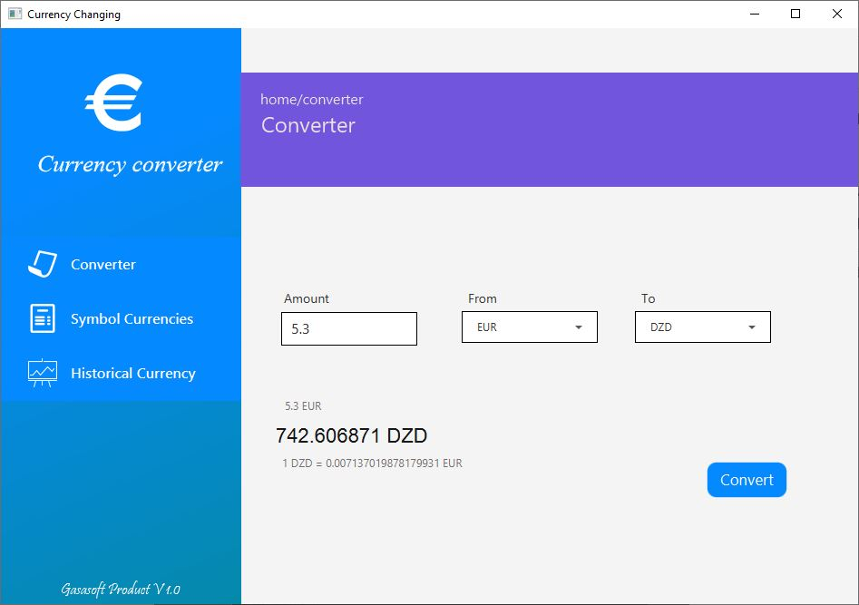
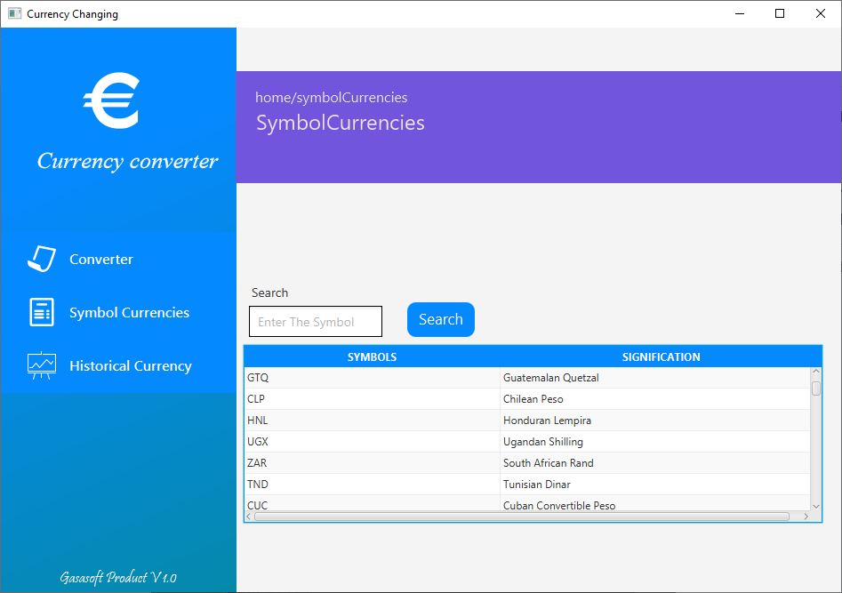
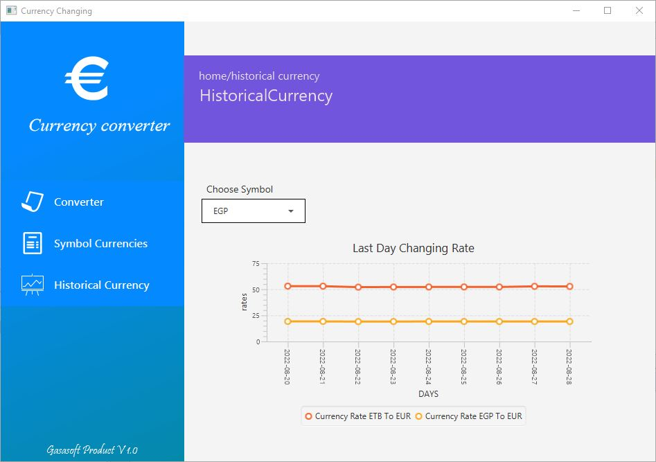

# JavaFx Currency Exchange
 #### A Full Frontend Desktop JavaFx App Connected Into Remote API With Flexible And Maintainable Backend java Code

this project focused in oriented object programming connected remotely into specific end points (API) which provide currency exchange .
the frontend based on javafx to get the input user, the functionalities which this app provide is :

- convert an amount from a specific currency symbol into another one.
- get the signification for all exist currency symbol.
- draw a line chart for a specific currency symbol for the last n days

#### i will split each functionality alone in separate class :

- classes to interact with remote API Connection.
- controller class to interact with the view model (FXML file in our case).
- models classes to create the objects fetched from the remote API.
- services class for the business logic and different functionalities to deal with the user input .
- class to implement an interface which contains all needed method in our project.
## screenshot javaFX project
####  converter window

####  signification symbols  window

####  histtorical currency line chart window

